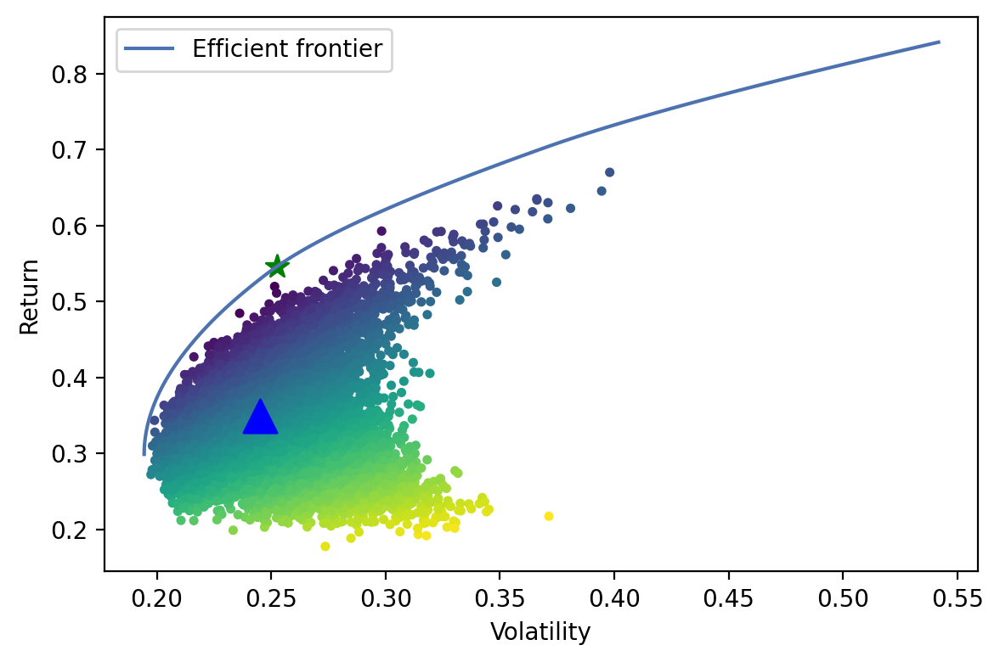

```python
import pandas as pd
from pypfopt import EfficientFrontier
from pypfopt import risk_models
from pypfopt import expected_returns
from pypfopt import plotting
import os
import numpy as np
from datetime import datetime
import matplotlib.pyplot as plt
import time
from ipynb.fs.full.prepare import index_df, topk
```

    split RELIANCE 1645.4 2.0112455690013444 818.1
    split RELIANCE 2194.7 8.345758072013917 528.9011030752401
    split HDFCBANK 2187.75 1.9869669860587622 1101.05
    split HDFCBANK 2519.7 19.661766684358625 254.6343263627014
    split INFY 1434.25 1.9456691311130707 737.15
    split INFY 1975.05 7.548897276749774 509.05366393585496
    split INFY 4349.85 116.56160069377809 281.71001962761125
    split INFY 3385.65 27348.90761583446 14.429709183719028
    split HDFC 3008.95 4.84377012234385 621.2
    split ICICIBANK 1794.1 4.953340695748206 362.2
    split TCS 3514.1 2.018379713391344 1741.05
    split TCS 778.0 8.144572754105939 192.80316652912552
    split TCS 1899.7 135.72602072222847 113.99615769064606
    split KOTAKBANK 1425.6 2.016122189223589 707.1
    split KOTAKBANK 864.6 7.729011898731478 225.53196548821552
    split KOTAKBANK 464.75 136.93248427402247 26.232331203070895
    split AXISBANK 1985.75 5.022764638927533 395.35


```python
print('Start')
```

    Start


```python
index_df
```


<div>
<style scoped>
    .dataframe tbody tr th:only-of-type {
        vertical-align: middle;
    }

    .dataframe tbody tr th {
        vertical-align: top;
    }

    .dataframe thead th {
        text-align: right;
    }
</style>
<table border="1" class="dataframe">
  <thead>
    <tr style="text-align: right;">
      <th></th>
      <th>RELIANCE</th>
      <th>HDFCBANK</th>
      <th>INFY</th>
      <th>HDFC</th>
      <th>ICICIBANK</th>
      <th>TCS</th>
      <th>KOTAKBANK</th>
      <th>HINDUNILVR</th>
      <th>AXISBANK</th>
    </tr>
    <tr>
      <th>Date</th>
      <th></th>
      <th></th>
      <th></th>
      <th></th>
      <th></th>
      <th></th>
      <th></th>
      <th></th>
      <th></th>
    </tr>
  </thead>
  <tbody>
    <tr>
      <th>2005-01-07</th>
      <td>64.973127</td>
      <td>24.934178</td>
      <td>0.074987</td>
      <td>149.955506</td>
      <td>72.415774</td>
      <td>9.872462</td>
      <td>2.074745</td>
      <td>141.05</td>
      <td>37.847682</td>
    </tr>
    <tr>
      <th>2005-01-10</th>
      <td>64.002574</td>
      <td>24.908748</td>
      <td>0.072943</td>
      <td>150.801954</td>
      <td>70.437311</td>
      <td>9.780365</td>
      <td>2.084969</td>
      <td>142.75</td>
      <td>38.245869</td>
    </tr>
    <tr>
      <th>2005-01-11</th>
      <td>62.996075</td>
      <td>24.585787</td>
      <td>0.072092</td>
      <td>148.954220</td>
      <td>70.810796</td>
      <td>9.679426</td>
      <td>1.990762</td>
      <td>141.15</td>
      <td>37.419631</td>
    </tr>
    <tr>
      <th>2005-01-12</th>
      <td>62.091424</td>
      <td>24.461179</td>
      <td>0.069701</td>
      <td>149.078090</td>
      <td>69.670152</td>
      <td>9.563752</td>
      <td>1.921385</td>
      <td>139.40</td>
      <td>36.105614</td>
    </tr>
    <tr>
      <th>2005-01-13</th>
      <td>62.319084</td>
      <td>25.374119</td>
      <td>0.071972</td>
      <td>148.582609</td>
      <td>71.477014</td>
      <td>9.525808</td>
      <td>1.989302</td>
      <td>140.05</td>
      <td>34.970781</td>
    </tr>
    <tr>
      <th>...</th>
      <td>...</td>
      <td>...</td>
      <td>...</td>
      <td>...</td>
      <td>...</td>
      <td>...</td>
      <td>...</td>
      <td>...</td>
      <td>...</td>
    </tr>
    <tr>
      <th>2021-04-26</th>
      <td>1937.850000</td>
      <td>1404.800000</td>
      <td>1343.550000</td>
      <td>2509.800000</td>
      <td>591.100000</td>
      <td>3100.800000</td>
      <td>1759.650000</td>
      <td>2360.65</td>
      <td>700.450000</td>
    </tr>
    <tr>
      <th>2021-04-27</th>
      <td>1988.650000</td>
      <td>1438.700000</td>
      <td>1348.500000</td>
      <td>2518.400000</td>
      <td>598.750000</td>
      <td>3132.000000</td>
      <td>1750.300000</td>
      <td>2379.85</td>
      <td>699.550000</td>
    </tr>
    <tr>
      <th>2021-04-28</th>
      <td>1997.300000</td>
      <td>1476.800000</td>
      <td>1356.000000</td>
      <td>2577.000000</td>
      <td>621.350000</td>
      <td>3124.100000</td>
      <td>1811.450000</td>
      <td>2406.55</td>
      <td>708.150000</td>
    </tr>
    <tr>
      <th>2021-04-29</th>
      <td>2024.050000</td>
      <td>1472.500000</td>
      <td>1356.350000</td>
      <td>2538.850000</td>
      <td>621.450000</td>
      <td>3115.250000</td>
      <td>1805.000000</td>
      <td>2407.60</td>
      <td>719.400000</td>
    </tr>
    <tr>
      <th>2021-04-30</th>
      <td>1994.500000</td>
      <td>1412.300000</td>
      <td>1354.350000</td>
      <td>2420.100000</td>
      <td>600.500000</td>
      <td>3035.650000</td>
      <td>1748.800000</td>
      <td>2353.75</td>
      <td>714.900000</td>
    </tr>
  </tbody>
</table>
<p>4045 rows × 9 columns</p>
</div>


```python
# index_df.plot(kind='line',y='LT',color='red')
```


```python
# Calculate expected returns and sample covariance
mu = expected_returns.mean_historical_return(index_df, compounding=True)
```


```python
mu
```


    RELIANCE      0.237850
    HDFCBANK      0.286014
    INFY          0.841863
    HDFC          0.189236
    ICICIBANK     0.140899
    TCS           0.428985
    KOTAKBANK     0.521663
    HINDUNILVR    0.191715
    AXISBANK      0.200953
    dtype: float64


```python
expected_returns.mean_historical_return(index_df, compounding=False)
```


    RELIANCE      0.290637
    HDFCBANK      0.315050
    INFY          7.862403
    HDFC          0.236050
    ICICIBANK     0.216091
    TCS           0.739331
    KOTAKBANK     0.811720
    HINDUNILVR    0.214057
    AXISBANK      0.272611
    dtype: float64


```python
S = risk_models.exp_cov(index_df)
```


```python
# Optimize for maximal Sharpe ratio
ef = EfficientFrontier(mu, S)
ef
```


    <pypfopt.efficient_frontier.efficient_frontier.EfficientFrontier at 0x105d92f70>


```python
# raw_weights = ef.max_sharpe()

# w = ef.nonconvex_objective(objective_functions.sharpe_ratio, objective_args=(ef.expected_returns, ef.cov_matrix), weights_sum_to_one=True)
```


```python
# raw_weights
```


```python
# cleaned_weights = ef.clean_weights()
# ef.save_weights_to_file("weights.csv")  # saves to file
# print(cleaned_weights)
# ef.portfolio_performance(verbose=True)
```


```python
fig, ax = plt.subplots()
plotting.plot_efficient_frontier(ef, ax=ax, show_assets=False)

# Find the tangency portfolio
raw_weights = ef.max_sharpe()
ret_tangent, std_tangent, _ = ef.portfolio_performance()
ax.scatter(std_tangent, ret_tangent, marker="*", s=100, c="g", label="Max Sharpe")

# Generate random portfolios
n_samples = 10000
w = np.random.dirichlet(np.ones(len(mu)), n_samples)
rets = w.dot(mu)
stds = np.sqrt(np.diag(w @ S @ w.T))
sharpes = rets / stds
ax.scatter(stds, rets, marker=".", c=sharpes, cmap="viridis_r")

# Nifty Top
nifty = np.array([(topk["WEIGHTAGE(%)"]/sum(topk["WEIGHTAGE(%)"])).values])
rets1 = nifty.dot(mu)
stds1 = np.sqrt(np.diag(nifty @ S @ nifty.T))
ax.scatter(stds1, rets1, marker="^", c='b', s=200)

# # Output
# ax.set_title("Efficient Frontier with random portfolios")
# ax.legend()
# plt.tight_layout()
# plt.savefig("ef_scatter.png", dpi=200)
# plt.show()
```


    <matplotlib.collections.PathCollection at 0x131d37430>


    

    


```python
# nifty.dot(mu)
# w.dot(mu).shape
# np.sqrt(np.diag(w @ S @ w.T)).shape
rets1
# stds1
```


    array([0.3494463])


```python
np.sqrt(np.diag(nifty @ S @ nifty.T)).shape
```


    (1,)


```python
nifty * S
```


<div>
<style scoped>
    .dataframe tbody tr th:only-of-type {
        vertical-align: middle;
    }

    .dataframe tbody tr th {
        vertical-align: top;
    }

    .dataframe thead th {
        text-align: right;
    }
</style>
<table border="1" class="dataframe">
  <thead>
    <tr style="text-align: right;">
      <th></th>
      <th>RELIANCE</th>
      <th>HDFCBANK</th>
      <th>INFY</th>
      <th>HDFC</th>
      <th>ICICIBANK</th>
      <th>TCS</th>
      <th>KOTAKBANK</th>
      <th>HINDUNILVR</th>
      <th>AXISBANK</th>
    </tr>
  </thead>
  <tbody>
    <tr>
      <th>RELIANCE</th>
      <td>0.019174</td>
      <td>0.007469</td>
      <td>0.004650</td>
      <td>0.004972</td>
      <td>0.006003</td>
      <td>0.002778</td>
      <td>0.002661</td>
      <td>0.001389</td>
      <td>0.002650</td>
    </tr>
    <tr>
      <th>HDFCBANK</th>
      <td>0.008237</td>
      <td>0.018093</td>
      <td>0.004144</td>
      <td>0.010680</td>
      <td>0.011066</td>
      <td>0.001919</td>
      <td>0.004818</td>
      <td>0.001004</td>
      <td>0.003656</td>
    </tr>
    <tr>
      <th>INFY</th>
      <td>0.005952</td>
      <td>0.004811</td>
      <td>0.043097</td>
      <td>0.003603</td>
      <td>0.002809</td>
      <td>0.005419</td>
      <td>0.002829</td>
      <td>0.001493</td>
      <td>0.001204</td>
    </tr>
    <tr>
      <th>HDFC</th>
      <td>0.007882</td>
      <td>0.015351</td>
      <td>0.004462</td>
      <td>0.016174</td>
      <td>0.012722</td>
      <td>0.002347</td>
      <td>0.005200</td>
      <td>0.001343</td>
      <td>0.004499</td>
    </tr>
    <tr>
      <th>ICICIBANK</th>
      <td>0.009905</td>
      <td>0.016556</td>
      <td>0.003621</td>
      <td>0.013241</td>
      <td>0.019703</td>
      <td>0.001898</td>
      <td>0.005595</td>
      <td>0.001104</td>
      <td>0.006705</td>
    </tr>
    <tr>
      <th>TCS</th>
      <td>0.005863</td>
      <td>0.003673</td>
      <td>0.008933</td>
      <td>0.003125</td>
      <td>0.002428</td>
      <td>0.006553</td>
      <td>0.001204</td>
      <td>0.001461</td>
      <td>0.000956</td>
    </tr>
    <tr>
      <th>KOTAKBANK</th>
      <td>0.007459</td>
      <td>0.012243</td>
      <td>0.006193</td>
      <td>0.009194</td>
      <td>0.009503</td>
      <td>0.001599</td>
      <td>0.007797</td>
      <td>0.001326</td>
      <td>0.003459</td>
    </tr>
    <tr>
      <th>HINDUNILVR</th>
      <td>0.004477</td>
      <td>0.002934</td>
      <td>0.003761</td>
      <td>0.002731</td>
      <td>0.002157</td>
      <td>0.002233</td>
      <td>0.001525</td>
      <td>0.003544</td>
      <td>0.000744</td>
    </tr>
    <tr>
      <th>AXISBANK</th>
      <td>0.010276</td>
      <td>0.012855</td>
      <td>0.003647</td>
      <td>0.011006</td>
      <td>0.015760</td>
      <td>0.001757</td>
      <td>0.004787</td>
      <td>0.000895</td>
      <td>0.009024</td>
    </tr>
  </tbody>
</table>
</div>


```python

```


```python
topk["WEIGHTAGE(%)"]/sum(topk["WEIGHTAGE(%)"])
```


    0    0.187846
    1    0.170331
    2    0.146738
    3    0.118499
    4    0.113852
    5    0.089008
    6    0.067024
    7    0.058266
    8    0.048436
    Name: WEIGHTAGE(%), dtype: float64


```python
raw_weights
```


    OrderedDict([('RELIANCE', 0.0),
                 ('HDFCBANK', 0.0),
                 ('INFY', 0.1974132196509596),
                 ('HDFC', 0.0),
                 ('ICICIBANK', 0.0),
                 ('TCS', 0.4157200297654416),
                 ('KOTAKBANK', 0.3868667505835988),
                 ('HINDUNILVR', 0.0),
                 ('AXISBANK', 0.0)])


